# ta06-RuizEric-OrtegaAritz-MartinezErnesto-MendezJavier-ASIXc1B

## Tasca nº1
> _Resum de la tasca:_ Hem d'aconseguir l'API-Key de la AEMET. descarregar el fitxer de la AEMET i aconseguir pujar al github la carpeta de les dades per poder treballar.

#### Procés d'Obtenció de l'API-Key
- Primer per aconseguir la key, hem anat a la web de la [AEMET](https://opendata.aemet.es/centrodedescargas/inicio).
- 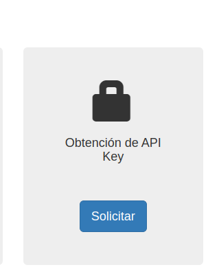
- Després, a l'apartat _"Obtenció de l'API Key"_, li donem a sol·licitar, posem el correu, comprovem que no som un robot i li donem a sol·licitar.
- Aleshores, reps un correu amb la confirmació i et donaran la key.
- 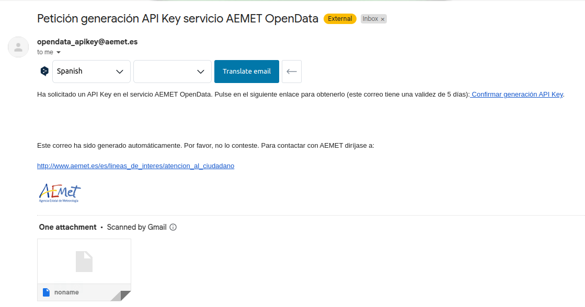

#### Procés de l'Obtenció dels fitxers
- Un cop tens l'API-Key, tornes a l'inici, i entres a l'apartat _"Accés General"_.
- 
- Dins, enganxes l'API-Key a l'apartat i a _"Cercar"_ cerques per _"Segle"_.
- 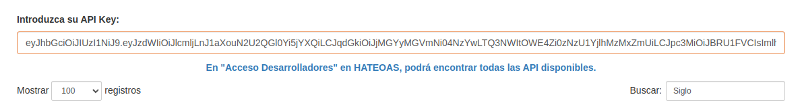
- Selecciona un període _"Diari"_ i li donem a _"Disponible a la web"_.
- 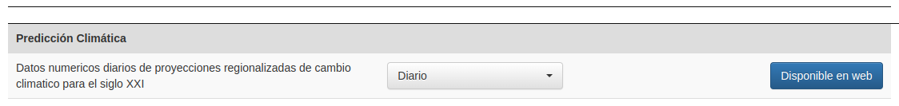
- Els filtres que hem utilitzat per trobar el fitxer han estat els següents:

  - **Metodo:** Regresión Rejilla
  - **Modelo:** MIROC5
  - **Escenarios:** RCP6.0
  - **Variable:** Precipitación
  - **Periodo:** 2006-2100

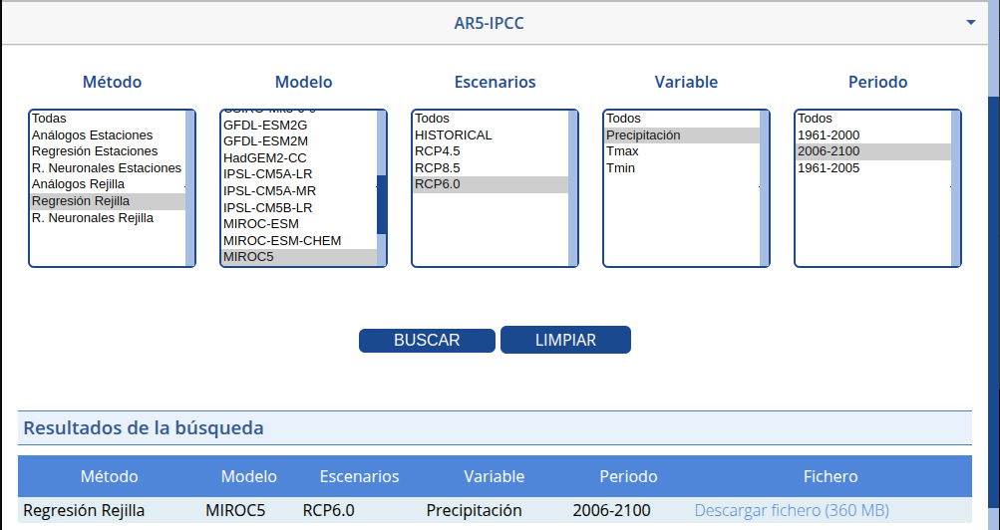

Un cop tinguem aquests filtres seleccionats, li donem a cercar, i descarreguem l'únic arxiu disponible.

## Tasca nº2 
> _Resum de la tasca:_ Organitzar, Analitzar i Processar les dades per fer el codi.

Per organitzar i separar els diferents passos (Revisar capçaleres, Verificar arxius, Netejar dades, documentar) hem creat diferents scripts. **(pas1.py | pas2.py | pas3.py | pas4.py)** per després ajuntar-ho tot en un mateix script **(main.py)**:

## L'script actual es el seguent:

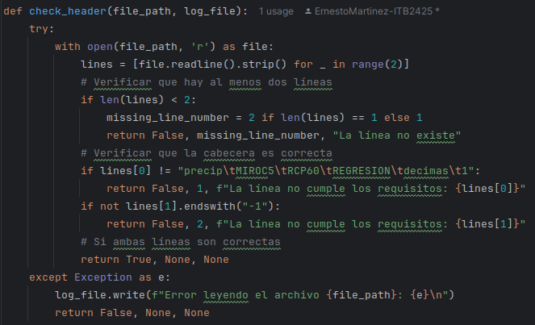

Aquesta part del codi defineix una funció que verifica si un fitxer té almenys dues línies i que la primera línia segueixi un format específic. Si no compleix aquests requisits, torna un missatge d'error i registra el problema.

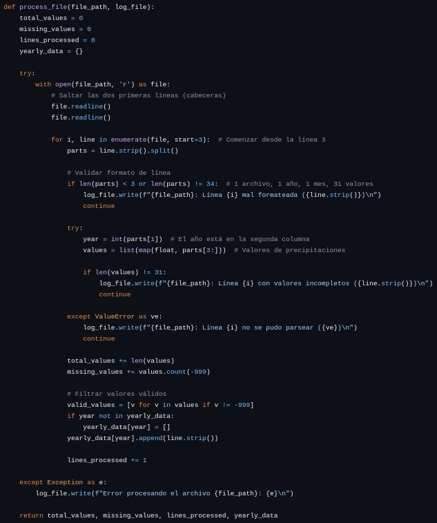

Aquesta altra part processa els fitxers un per un i llegeix el fitxer, valida el format de cada línia, analitza els valors d'any i precipitacions, i registra qualsevol error trobat. A més, duu un seguiment del nombre total de valors, valors faltants i línies processades.

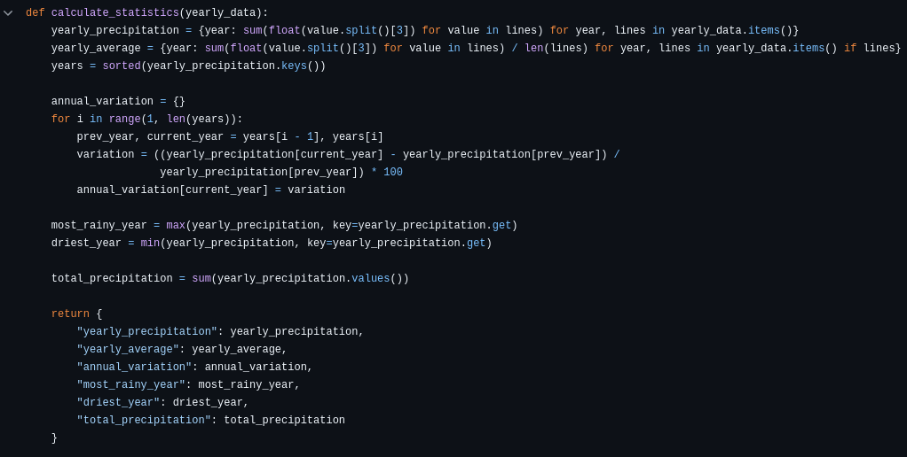

La darrera part. Organitza les dades de precipitacions per any, analitza els valors i genera estadístiques, incloent-hi el seguiment de valors, línies i faltants.

## Tasca nº3 
> _Resum de la tasca:_ Generació de resultats (resums estadístics, gràfics i .CSV)

Per aquesta tasca, hem decidit dividirla entre la web i el codi, degut a que surt millor posar els grafics directament a la web en comptes de al codi per despres posar una foto. El resultat es el seguent:

### PART de main.py:

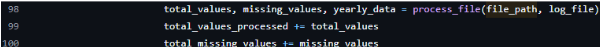

Procesa els fitxers y suma els valors a les estadístiques generals

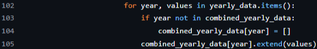

Aqui acumulem les dades anuals

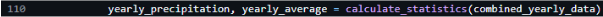

Calcula les estadístiques generals

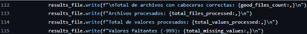

Escriu les estadístiques en l'archiu de resultats

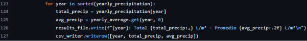

Guarda els resultats en resultados.txt y resultados.csv

## Tasca nº4 
> _Resum de la tasca:_ Creació i publicació de la web

aaaaa
## Tasca nº5 
> _Resum de la tasca:_ Reflexió sobre el treball dels nostres companys

Entre nosaltres hem omplert la taula de reflexio per separat, els resultats son els seguents:

### ARITZ:

### ANDRES:

### ERNESTO:

### ERIC:

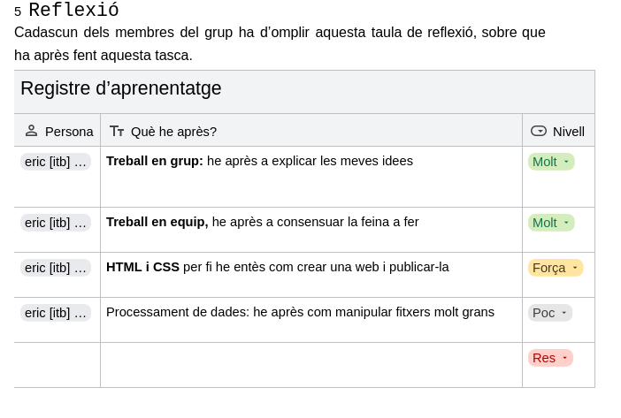

